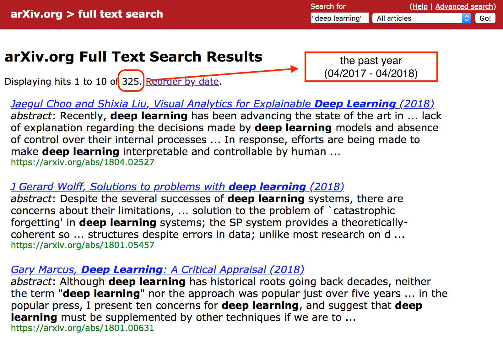
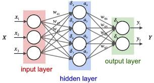
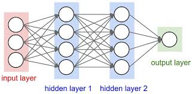
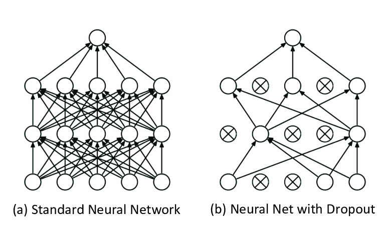

class: center, middle

# Hands on Neural Networks

 Alexandre Boucaud - Emille Ishida

---
## A trendy subject

enormous attention in the media

[Google trends](https://trends.google.com/trends/explore?date=today%205-y&q=machine%20learning,deep%20learning,neural%20networks) 
<!-- <script type="text/javascript" src="https://ssl.gstatic.com/trends_nrtr/1386_RC02/embed_loader.js"></script> -->
<!-- <script type="text/javascript"> trends.embed.renderExploreWidget("TIMESERIES", { "comparisonItem": [{ "keyword": "machine learning", "geo": "", "time": "today 5-y" }, { "keyword": "deep learning", "geo": "", "time": "today 5-y" }, { "keyword": "neural networks", "geo": "", "time": "today 5-y" }], "category": 0, "property": "" }, { "exploreQuery": "date=today%205-y&q=machine%20learning,deep%20learning,neural%20networks", "guestPath": "https://trends.google.com:443/trends/embed/" }); </script> -->

---

class: center, middle


---
class: center, middle
<!-- shift in the science community -->




---

## Applications in astro

---
## Foreword

The following slides provide examples of neural network models written in Python, using the [Keras][keras] library. Keras provides a high level API to create models and to run them with numerical tensor libraries (_backends_) such as [TensorFlow][tf], [CNTK][cntk] or [Theano][theano].

All presented models work with Keras version 2.X.

[keras]: https://keras.io/
[tf]: https://www.tensorflow.org/
[cntk]: https://docs.microsoft.com/fr-fr/cognitive-toolkit/
[theano]: http://www.deeplearning.net/software/theano/

---

## Outline

1. Neural nets
  - hidden layers - MLP - activation
  - gradients - backpropagation - optimization

2. Convolutional Neural Networks (CNN)
  - convolutional layers - kernels
  - strides - pooling - dropout

3. Setup and tuning of your models
  

---
## Weights

---

## Neurons

multiple inputs  
one output

---
## Linear layers

array of neurons
multiple inputs
multiple outputs

---
## Anatomy of a neural net

.center[]

---
## Multi-layer perceptron (MLP)

.center[]

---
## Multi-layer perceptron (MLP)

```python
from keras.models import Sequential
from keras.layers import Dense

# initialize model
model = Sequential()

# add layers
model.add(Dense(4, input_dim=3))
model.add(Dense(4))
model.add(Dense(1))
```

--

```python
# print model structure
model.summary()
```

--

```
_________________________________________________________________
Layer (type)                 Output Shape              Param #
=================================================================
dense_1 (Dense)              (None, 4)                 16
_________________________________________________________________
dense_2 (Dense)              (None, 4)                 20
_________________________________________________________________
dense_3 (Dense)              (None, 1)                 5
=================================================================
Total params: 41
Trainable params: 41
Non-trainable params: 0
_________________________________________________________________
```

--- 
## Non linearities - activation 

--- 
## Activation functions 
```python 

```


---

## Convolutional Neural Networks

use kernels instead of neurons


---
## Convnets - kernels

.center[]
.credits[[arXiv:1603.07285](https://arxiv.org/abs/1603.07285)]

---
## Convnets - strides

.left-column[]
.right-column[]
.credits[[arXiv:1603.07285](https://arxiv.org/abs/1603.07285)]

---
## Convnets - strides 

.left-column[
```python
from keras.model import Sequential
from keras.layers import Conv2D

model = Sequential()
model.add(Conv2D(1, (3, 3), 
                 strides=1, 
                 padding='same', 
                 input_shape=(5, 5, 1)))
model.summary()
```

```
_________________________________________
Layer (type)            Output Shape     
=========================================
conv2d (Conv2D)         (None, 5, 5, 1)  
=========================================
Total params: 10
Trainable params: 10
Non-trainable params: 0
_________________________________________
```
] 
.right-column[

] 

---
## Convolutional nets - strides

.left-column[
```python
from keras.model import Sequential
from keras.layers import Conv2D

model = Sequential()
model.add(Conv2D(1, (3, 3), 
*                strides=2, 
                 padding='same', 
                 input_shape=(5, 5, 1)))
model.summary()
```

```
_________________________________________
Layer (type)            Output Shape     
=========================================
conv2d (Conv2D)         (None, 3, 3, 1)  
=========================================
Total params: 10
Trainable params: 10
Non-trainable params: 0
_________________________________________
```
]
.right-column[ 

]
 
---
class: center, middle
# Optimization


---
## Overfitting

---
## Learning rate

---
## Dropout

a % of random neurons are .grey[switched off] during training  
it mimics different architectures being trained at each step 

.center[]
.credits[Hinton +12]

---
## Dropout

.left-column[
```python
from keras.model import Sequential
from keras.layers import Conv2D

model = Sequential()
model.add(Conv2D(1, (3, 3), 
*                strides=2, 
                 padding='same', 
                 input_shape=(5, 5, 1)))
model.summary()
```
]

.right-column[]

---

## Batch normalization

.left-column[
```python
from keras.layers import BatchNormalization

model = Sequential()
model.add(Conv2D(...))
*model.add(BatchNormalization())

```
]
---
## what we did not talk about

- weight initialization
- gradient clipping
- regularization

---
class: center, middle

# In practice

---
class: middle

<!-- ## Sorry... -->

There is currently .red[no magic recipe] to find a network architecture 
that will solve your particular problem.

.center[`¯\\\_(ツ)\_/¯`]

But here are some advice for non-specialists to guide you in the right direction and/or 
get you out of trouble.

---
## Start with existing (working) models

- look for a relevant architecture for your problem  
  (arXiv, blogs, websites)

.center[

]

---
## Start with existing (working) models

- look for a relevant architecture for your problem  
  (arXiv, blogs, websites)
- find an implementation on [GitHub][gh]  
  (often the case if algorithm is efficient)

.center[
 
]

---
## Start with existing (working) models

- look for a relevant architecture for your problem  
  (arXiv, blogs, websites)
- find an implementation on [GitHub][gh]  
  (often the case if algorithm is efficient)
- play with the examples and adjust to your inputs/outputs

--
- start tuning the model parameters..

[gh]: https://github.com/

---
## Plot the training information

- training and validation loss

Retrieve the information from the model history

.left-column[
```python
import matplotlib.pyplot as plt

# ...
*history = model.fit(
    X_train, y_train,
    validation_data=(X_val, y_val))

# Visualizing the training                    
plt.plot(history.history['loss'],
         label='train')
plt.plot(history.history['val_loss'],
         label='validation')
plt.legend()
plt.xlabel('epochs')
plt.ylabel('loss')


```
]
.right-column[ 

]

---
## Plot the training information

- training and validation loss
- training and validation accuracy

.left-column[
```python
import matplotlib.pyplot as plt

# ...
*model.compile(..., metrics=['acc'])

history = model.fit(
    X_train, y_train,
    validation_data=(X_val, y_val))

# Visualizing the training                    
plt.plot(history.history['acc'],
         label='train')
plt.plot(history.history['val_acc'],
         label='validation')
plt.legend()
plt.xlabel('epochs')
plt.ylabel('accuracy')
```
] .right-column[
 ]

---
## Learning rate


---
class: middle, center

## Next ?

Developments in these field are happening at a high pace,  
stay tuned !

---
class: center, middle
But keep in mind that .red[not everything] is differentiable..


