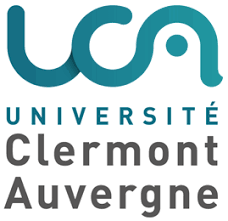
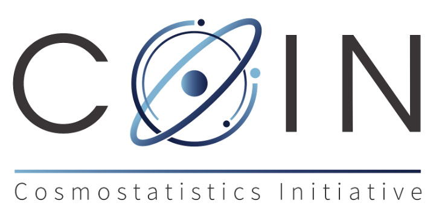

# Emille E. O. Ishida 

Astronomer &  
Machine Learning enthusiast at   

Co-head of the Coin initiative  

[emilleishida@gmail.com](mailto:emilleishida@gmail.com) - [@emilleishida](https://twitter.com/emilleishida)  
[www.emilleishida.com](https://www.emilleishida.com)

---

# Alexandre Boucaud 

Astrophysicist &  
Software Engineer at  

[aboucaud@lal.in2p3.fr](mailto:aboucaud@lal.in2p3.fr)  - [@alxbcd][twitter]

Interests:
- [RAMP](https://ramp.studio) collaborative science challenge platform
- applying ML to astrophysics (galaxy morphology, blending)

[twitter]: https://twitter.com/alxbcd
